# Report - Nguyen Hai Duc - 20200170

## Git clone

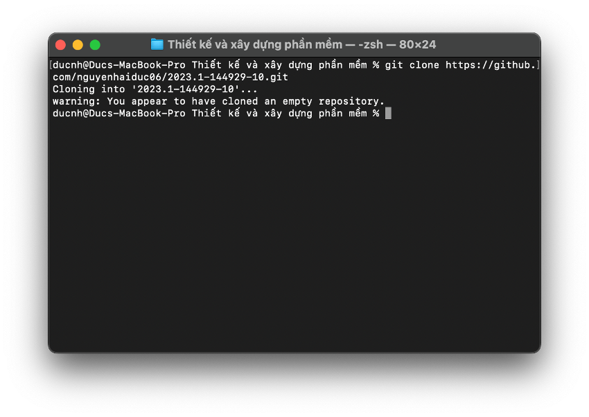

## Git add

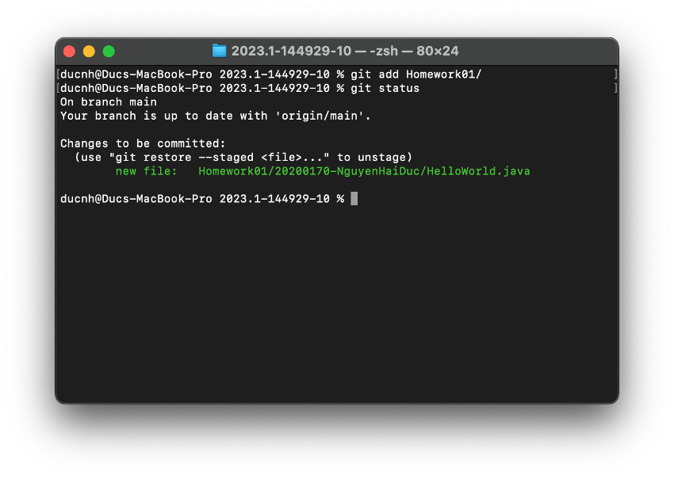

## Git status

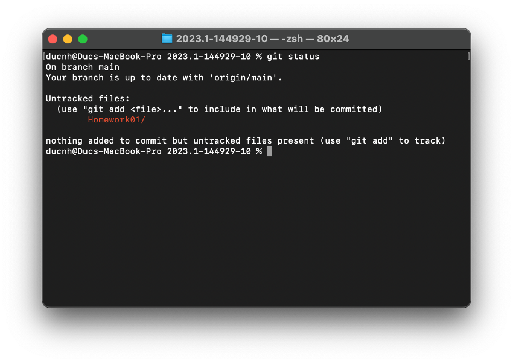

## Git commit & push

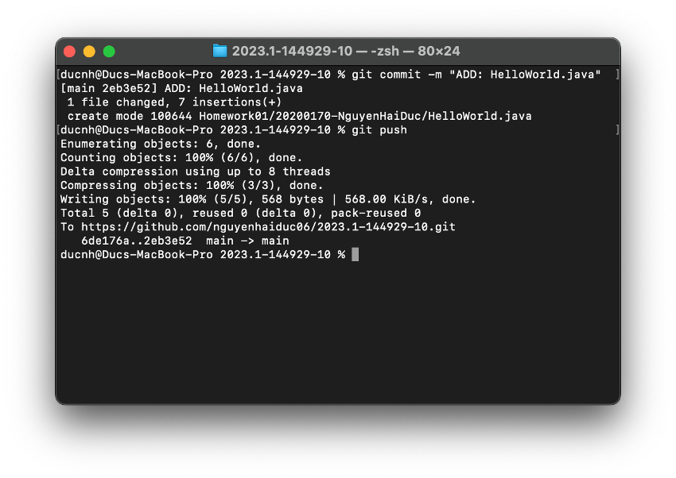

## Git branch

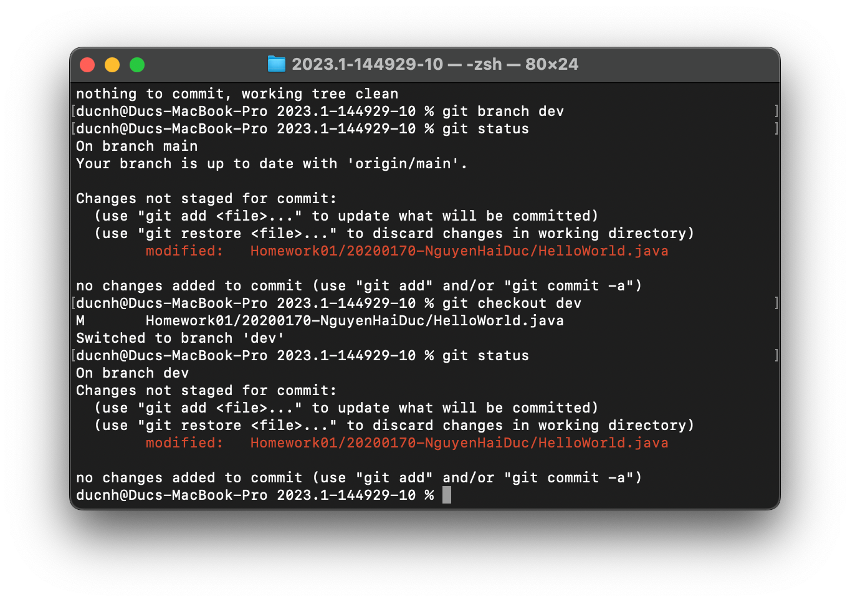

## Git pull

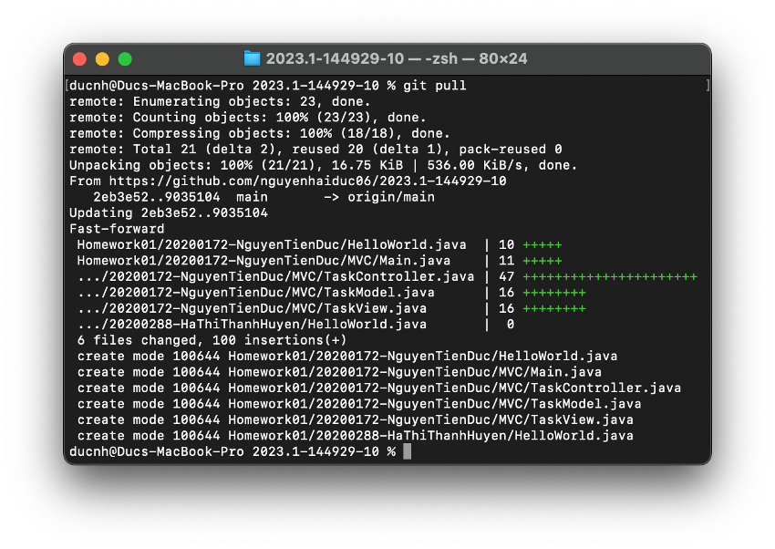

## Create pull request & merge

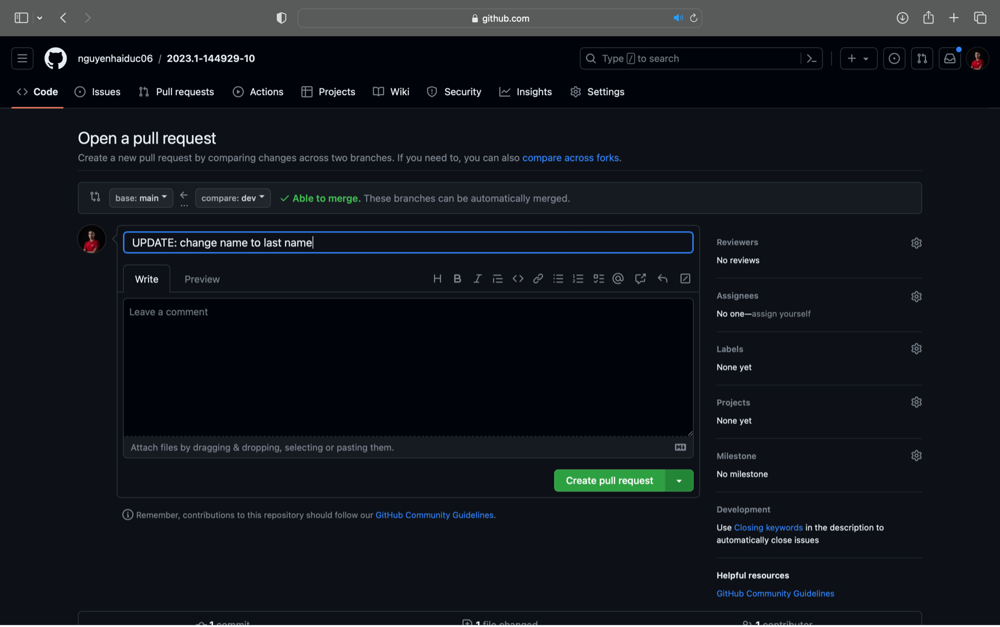
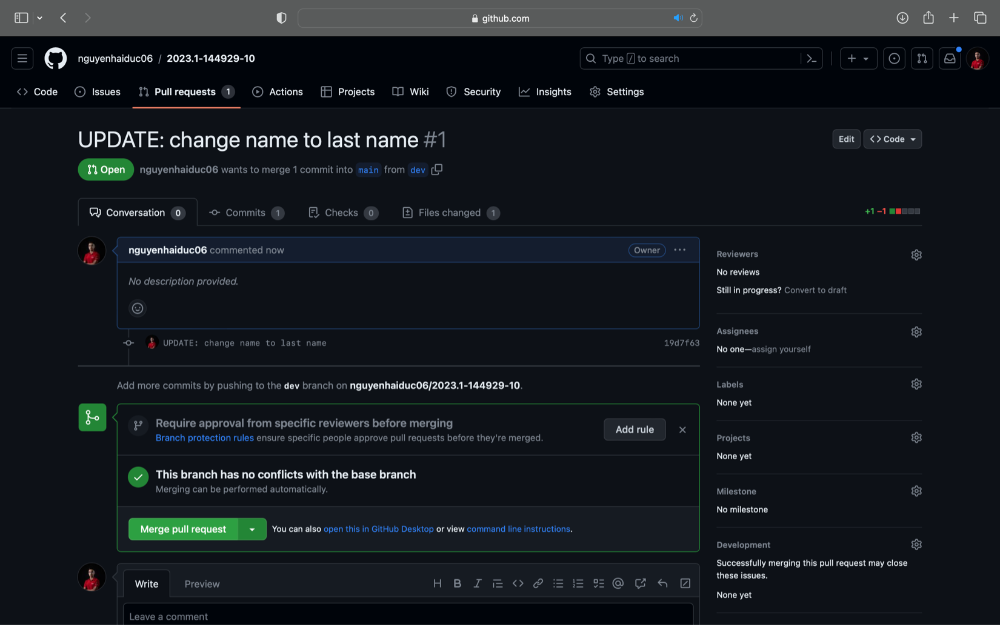

## Create a pull request that can’t be automatically merged

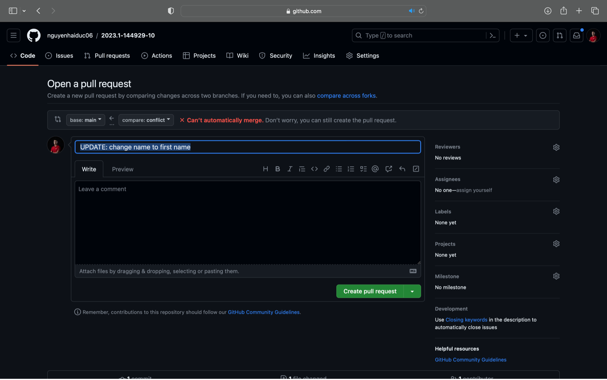
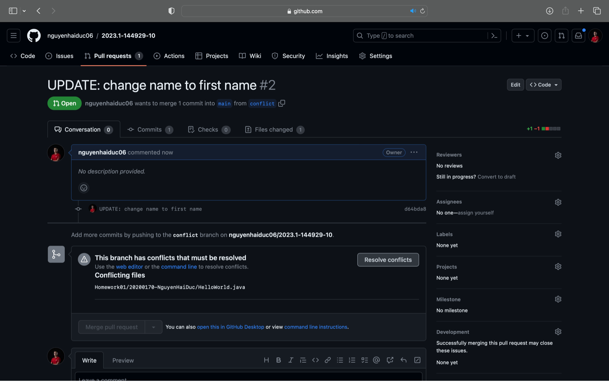

## Resolve conflicts

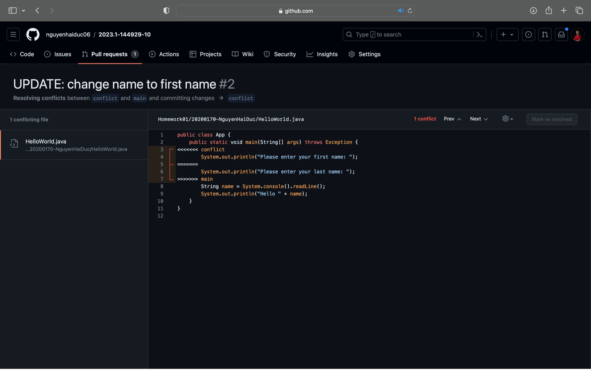
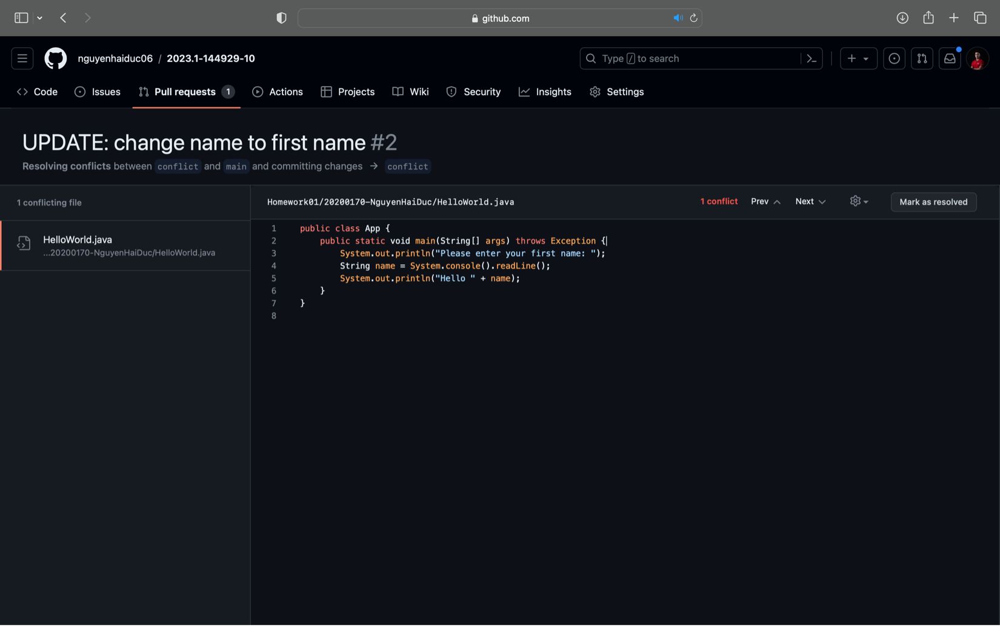

## Merge pull request after resolving conflicts

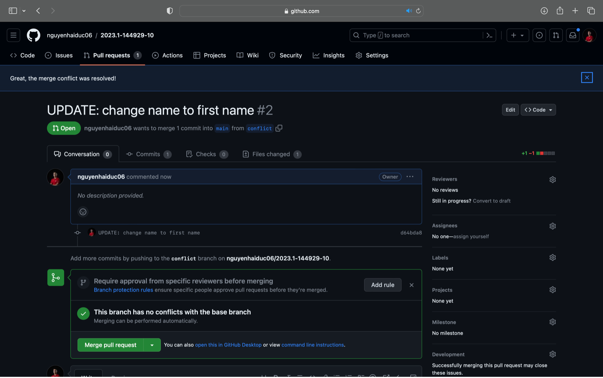
